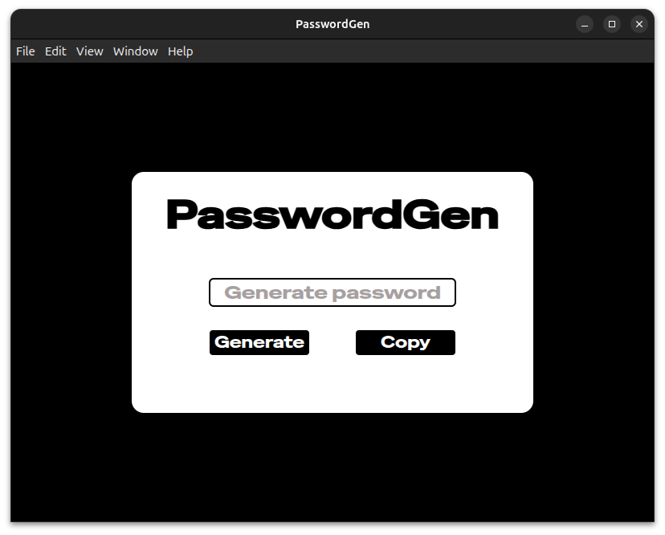

# PasswordGen - Desktop 💻

A password generation desktop application built with **Electron**, **HTML**, **CSS** and **Javascript**.



- - -

## 📦 Features

- 🔄 **Generate** a eight-characters-long random password composed of ***alphabetical characters*** (*lowercase* and *uppercase*), ***digits***, and ***special characters***

- 📋 **Copy** the generated password and use it anywhere you need it

- - -

## 🚀 Getting Started

### Option 1 : Build from source

#### 📁 Clone the repository

```bash
git clone https://github.com/Celian974/PasswordGen.git
```
#### 📁 Navigate to the PasswordGen directory

```bash
cd PasswordGen
```

#### 📥 Install the App (`.deb`)

```bash
sudo dpkg -i Desktop/dist/passwordgen_1.0.0_amd64.deb
```

- The app will then appear among your applications with a "PG" desktop icon (for PasswordGen).

### Option 2: Download from Releases

You can download the `.deb` package directly from the `Releases` page and install it with :

```bash
sudo dpkg -i passwordgen_1.0.0_amd64.deb
```

- The app will then appear among your applications with a "PG" desktop icon (for PasswordGen).

You can also download the `.exe` file directly from the `Releases` page and then run it on your computer.

---
## 🛠️ Technologies used

- Electron
- HTML/CSS/JavaScript
- Canva (for icons design)
---
## 🧑‍💻 Author

Celian SIAMPIRAVE

---
## 📝 License
This project is licensed under the MIT License.
